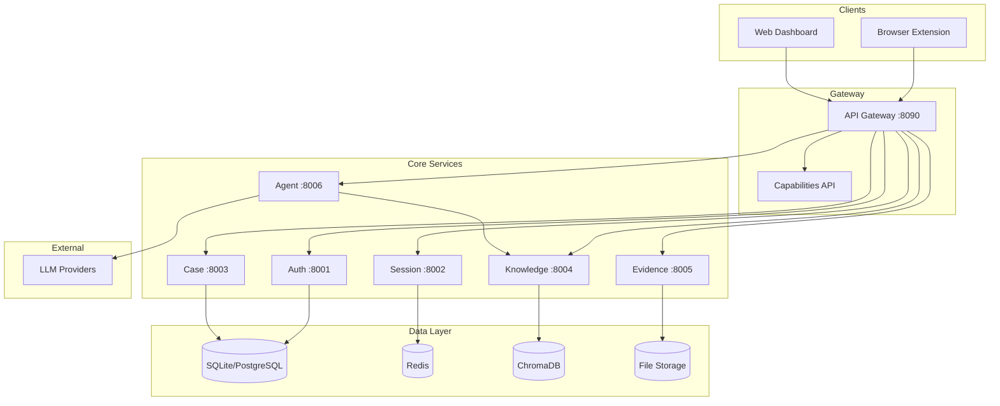

# FaultMaven

**The AI-Powered Troubleshooting Copilot for Modern Engineering**

FaultMaven correlates your live telemetry with your runbooks, docs, and past fixes. It delivers answers grounded in your actual system—not generic guesses. Resolve incidents faster with an AI copilot that understands both your stack and your organization.

[](LICENSE)
[](https://hub.docker.com/u/faultmaven)
[](https://github.com/FaultMaven)

<!-- TODO: Add screenshot or demo GIF here showing browser extension or dashboard -->

---

## 🚀 Choose Your Path

### I want to **use** FaultMaven
→ **[Deploy Self-Hosted](https://github.com/FaultMaven/faultmaven-deploy)** — Docker Compose, ready in minutes
→ **[Join Beta Founders](https://faultmaven.ai/founders)** — Free Enterprise Cloud access

### I want to **contribute** to FaultMaven
→ **[Browse Repositories](#repositories)** — Find the service or client you want to improve
→ **[Good First Issues](https://github.com/search?q=org%3AFaultMaven+label%3A%22good+first+issue%22+state%3Aopen)** — Start here if you're new
→ **[Contributing Guide](CONTRIBUTING.md)** — Code style, workflows, community guidelines

### I want to **learn** about FaultMaven
→ **[Product Overview](https://faultmaven.ai/product)** — See what FaultMaven can do
→ **[Use Cases](https://faultmaven.ai/use-cases)** — Real-world troubleshooting scenarios
→ **[Architecture](#architecture)** — System design and data flow

---

## Why FaultMaven?

Traditional observability tools tell you **what** broke. Generic LLMs guess **why**, but can't see your infrastructure. FaultMaven bridges this gap.

### 1. Deep Context Awareness
Generic chatbots can't access your logs, configs, or deployments. FaultMaven auto-ingests your **full stack context**—correlating errors with recent changes, configuration drift, and system state.

**Example:** A Kubernetes pod is crashlooping. ChatGPT gives generic advice. FaultMaven ingests your pod logs, deployment YAML, and recent Git commits—then tells you the ConfigMap changed 2 hours ago.

### 2. Institutional Memory
Most troubleshooting knowledge dies in Slack threads. FaultMaven's **tiered knowledge base** ensures you never solve the same problem twice:

- **Global Knowledge Base:** Pre-loaded troubleshooting patterns for common tech stacks (Kubernetes, PostgreSQL, Redis, AWS). Think of it as a curated library of runbooks and post-mortems from the community.
- **Team Knowledge Base (Enterprise):** Automatically indexes your organization's runbooks, post-mortems, and past case resolutions.
- **Personal Context:** Your local configurations, environment variables, and deployment history.

### 3. Zero Context-Switching
Stop copying errors between browser tabs. The **[FaultMaven Copilot](https://github.com/FaultMaven/faultmaven-copilot)** browser extension overlays AI troubleshooting directly onto your existing tools—AWS Console, Datadog, Grafana, or localhost.

### 4. Continuous Learning
Every resolved case becomes institutional knowledge. FaultMaven **automatically indexes your solutions**, building a searchable history of fixes specific to your architecture. The system gets smarter about your infrastructure with every problem you solve.

---

## Self-Hosted vs. Enterprise Cloud

FaultMaven is **open core**. Run it yourself for free, or let us manage it for you.

| | **Self-Hosted** | **Enterprise Cloud** |
|---|---|---|
| **Best for** | Individual engineers, air-gapped environments, total data sovereignty | Teams needing HA, shared context, zero maintenance |
| **Pricing** | Free Forever (Apache 2.0) | Managed SaaS (Private Beta) |
| **Scope** | Individual user | Organization / multi-team |
| **Infrastructure** | Self-managed Docker Compose | Managed HA Kubernetes (AWS/GCP) |
| **Data Storage** | SQLite (local disk), local ChromaDB | Managed PostgreSQL, Redis, S3 |
| **Context Scope** | Personal knowledge base only | Global KB + Team KB + shared cases |
| **Identity** | Basic auth (single user) | SSO/SAML (Okta, Azure AD, Google) |
| **Client Integrations** | Browser Extension Overlay | Browser Extension Overlay |
| **Server Integrations** | — | Slack, PagerDuty, ServiceNow |

**Self-Hosted includes:**
- All 7 core microservices (Apache 2.0 license)
- Browser extension + web dashboard
- Multi-provider LLM support (OpenAI, Anthropic, Google, Groq)
- Local LLM support (Ollama, vLLM, LocalAI)
- Knowledge base with semantic search (RAG)
- Case tracking and evidence management

**Want Enterprise Cloud?** [Join the Beta Founders Program](https://faultmaven.ai/founders) for free access during beta.

---

## Architecture



**How it works:**

1. **Browser Extension** captures context (errors, logs, stack traces) from your current page
2. **API Gateway** routes requests and handles authentication
3. **Agent Service** orchestrates AI conversations, pulling relevant context from the Knowledge Base
4. **Knowledge Service** performs semantic search across your runbooks, past cases, and the Global KB
5. **Case Service** tracks investigations and automatically links evidence to resolutions

For detailed architecture, see [ARCHITECTURE.md](./docs/ARCHITECTURE.md).

---

## Repositories

The FaultMaven ecosystem is organized into multiple repositories. Each is independently useful and can be contributed to separately.

### 🎯 Deployment

**Start here if you want to run FaultMaven:**

| Repository | Purpose | When to use it |
|------------|---------|----------------|
| **[faultmaven-deploy](https://github.com/FaultMaven/faultmaven-deploy)** | Docker Compose orchestration | Deploy self-hosted FaultMaven |
| [fm-charts](https://github.com/FaultMaven/fm-charts) | Kubernetes Helm charts | Deploy to Kubernetes cluster |

### 🖥️ Client Applications

**User-facing applications. Great for frontend contributors:**

| Repository | Purpose | Good First Contribution |
|------------|---------|-------------------------|
| **[faultmaven-copilot](https://github.com/FaultMaven/faultmaven-copilot)** | Browser extension (Chrome, Firefox, Edge) | Add new site integrations |
| **[faultmaven-dashboard](https://github.com/FaultMaven/faultmaven-dashboard)** | Web UI for knowledge management | Improve KB search UI |

### ⚙️ Backend Services

**Python/FastAPI microservices. Backend logic lives here:**

| Repository | Purpose | Good First Contribution |
|------------|---------|-------------------------|
| [fm-agent-service](https://github.com/FaultMaven/fm-agent-service) | AI troubleshooting orchestration | Add new LLM provider support |
| [fm-knowledge-service](https://github.com/FaultMaven/fm-knowledge-service) | Semantic search & RAG | Improve embedding models |
| [fm-case-service](https://github.com/FaultMaven/fm-case-service) | Investigation tracking | Add export formats |
| [fm-evidence-service](https://github.com/FaultMaven/fm-evidence-service) | File/log uploads | Add new file type parsers |
| [fm-auth-service](https://github.com/FaultMaven/fm-auth-service) | Authentication | Improve session management |
| [fm-session-service](https://github.com/FaultMaven/fm-session-service) | Session persistence | Add Redis clustering |
| [fm-api-gateway](https://github.com/FaultMaven/fm-api-gateway) | Request routing, capabilities API | Add rate limiting |
| [fm-job-worker](https://github.com/FaultMaven/fm-job-worker) | Background task processing | Add new job types |

### 📦 Shared Libraries

| Repository | Purpose | Good First Contribution |
|------------|---------|-------------------------|
| [fm-core-lib](https://github.com/FaultMaven/fm-core-lib) | Common utilities, models, clients | Add utility functions |

**Want to contribute but not sure where to start?** Check out issues tagged [`good-first-issue`](https://github.com/search?q=org%3AFaultMaven+label%3A%22good+first+issue%22+state%3Aopen) across all repos, or ask in [GitHub Discussions](https://github.com/FaultMaven/faultmaven/discussions).

---

## LLM Support

FaultMaven works with your preferred AI provider. You can start **completely free** with local models.

| Provider | Models | Best For | Cost |
|----------|--------|----------|------|
| **OpenAI** | GPT-4o, GPT-4 Turbo | Best overall quality | ~$0.01-0.03 per troubleshooting session |
| **Anthropic** | Claude 3.5 Sonnet, Claude 3 Opus | Complex reasoning, long context | ~$0.02-0.04 per session |
| **Google** | Gemini Pro | Good balance of speed/quality | ~$0.005-0.01 per session |
| **Groq** | Llama 3, Mixtral | Very fast inference | Free tier available |
| **Local (Ollama)** | Llama 3, Mistral, CodeLlama | **Air-gapped, zero cost** | Free (runs on your hardware) |

**Privacy & Security:**
- **Air-Gapped Deployments:** Use Ollama or vLLM for completely offline operation
- **Data Redaction:** FaultMaven can automatically scrub PII, secrets, and sensitive data before sending to LLMs (see [SECURITY.md](./docs/SECURITY.md))

For configuration details, see the [Deployment Guide](https://github.com/FaultMaven/faultmaven-deploy).

---

## Contributing

We're building FaultMaven in the open and welcome all contributions—code, documentation, bug reports, feature ideas, or just feedback.

**Ways to Contribute:**

- **Code:** Pick up a `good-first-issue` or propose a new feature
- **Documentation:** Improve guides, add examples, fix typos
- **Knowledge Base:** Contribute troubleshooting patterns for the Global KB
- **Testing:** Report bugs, test edge cases, improve test coverage
- **Community:** Answer questions in Discussions, help other users

See [CONTRIBUTING.md](CONTRIBUTING.md) for detailed guidelines.

**Example workflow:**
```bash
# 1. Fork and clone a service repository
git clone https://github.com/YOUR_USERNAME/fm-agent-service.git
cd fm-agent-service

# 2. Run the full stack locally for testing
cd ../faultmaven-deploy && docker compose up -d

# 3. Make changes, test, submit PR
```

**Not a developer?** You can still help:
- Improve documentation
- Report bugs with detailed reproduction steps
- Share your use cases and feature ideas
- Help answer questions in Discussions

---

## Documentation

### Getting Started
- **[Deployment Guide](https://github.com/FaultMaven/faultmaven-deploy)** — Complete self-hosting setup
- **[Development Guide](./docs/DEVELOPMENT.md)** — Local development environment
- **[FAQ](https://faultmaven.ai/faq)** — Frequently asked questions

### Configuration & Operations
- **[Security Guide](./docs/SECURITY.md)** — Authentication, secrets, data redaction
- **[Troubleshooting](./docs/TROUBLESHOOTING.md)** — Common issues and solutions
- **[API Reference](./docs/API.md)** — REST endpoint documentation

### Architecture & Design
- **[Architecture Overview](./docs/ARCHITECTURE.md)** — System design and data flow
- **[Roadmap](https://faultmaven.ai/roadmap)** — What we're building next

---

## Support

### Community Support (Free)
- **[GitHub Discussions](https://github.com/FaultMaven/faultmaven/discussions)** — Ask questions, share tips
- **[GitHub Issues](https://github.com/FaultMaven/faultmaven/issues)** — Report bugs, request features
- **[Website](https://faultmaven.ai)** — Product info, use cases, guides

### Enterprise Support
- **Email:** [support@faultmaven.ai](mailto:support@faultmaven.ai)
- **Enterprise SLA:** Included with Enterprise Cloud subscription

---

## License

**Apache 2.0** — Use commercially, fork freely, contribute back if you'd like.

Same license as Kubernetes, TensorFlow, and Apache Kafka. We believe in open infrastructure.

---

<p align="center">
  <strong>FaultMaven</strong> — Your AI copilot for troubleshooting.<br>
  Built on the same core analysis engine. Use Self-Hosted for personal context, or Enterprise for shared team intelligence.
</p>
