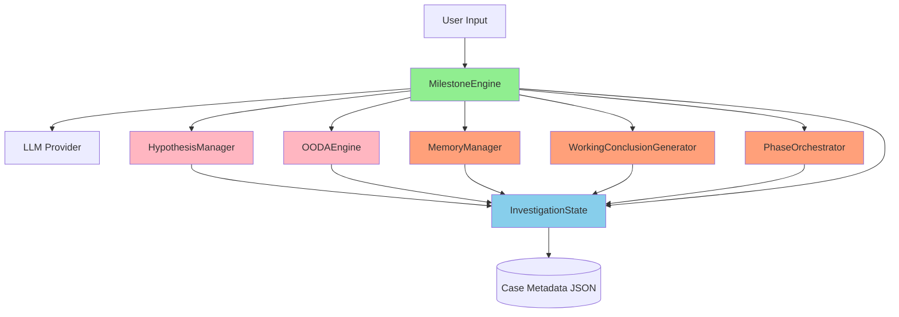
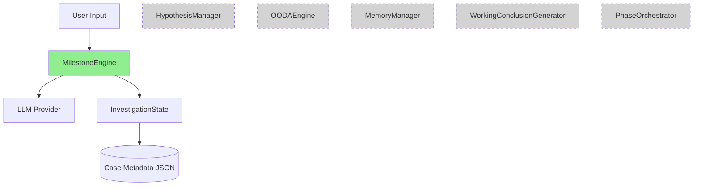
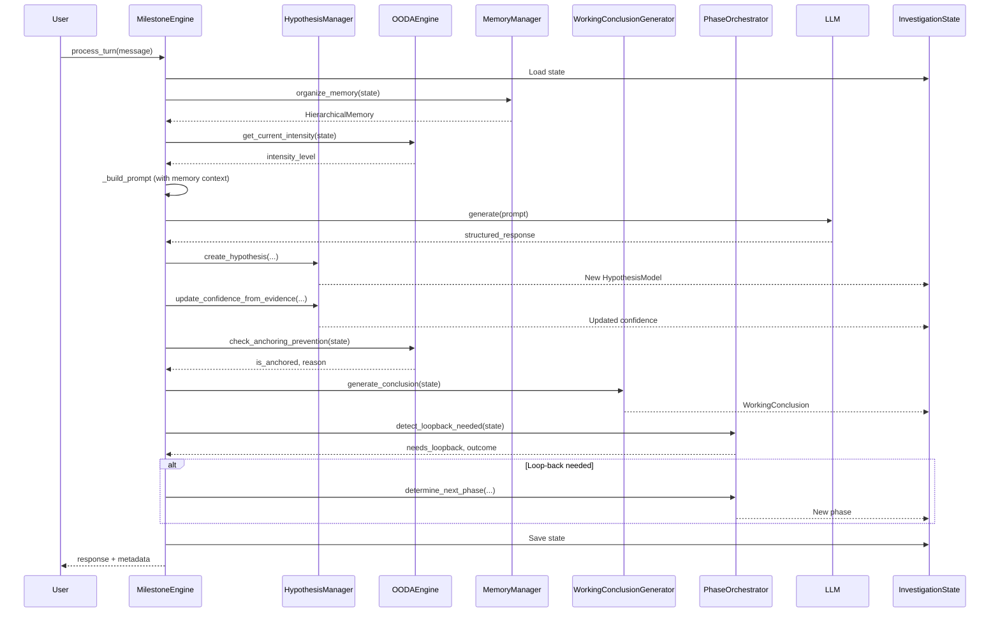

# Investigation Framework Design Audit

**Document Version**: 1.0
**Date**: 2025-12-25
**Audit Scope**: 6 investigation engines in `/home/swhouse/product/faultmaven/src/faultmaven/modules/case/engines/`
**Status**: 🔴 CRITICAL ISSUES FOUND

---

## Executive Summary

This audit reveals **critical integration gaps** in the FaultMaven investigation framework. While all 6 engines exist and implement sophisticated logic individually, they **do not actually work together** in the current implementation. The MilestoneEngine (main orchestrator) does not instantiate or call any of the Phase 3 engines (MemoryManager, WorkingConclusionGenerator, PhaseOrchestrator), making them effectively **orphaned modules**.

**Key Findings**:
- ✅ **Engines exist**: All 6 engines are implemented with complete business logic
- ❌ **Integration missing**: MilestoneEngine does not call HypothesisManager, OODAEngine, or Phase 3 engines
- ❌ **Data model mismatch**: Critical fields missing from InvestigationState models
- ❌ **Type inconsistency**: `hypotheses` is List but code treats it as Dict in 2 locations
- ⚠️ **Placeholder logic**: Milestone detection uses keyword matching instead of structured output

---

## Architecture Overview

### Intended Design (from code comments and imports)



**Legend**:
- 🟢 Green: Fully implemented and integrated (MilestoneEngine only)
- 🔴 Pink: Implemented but not called by MilestoneEngine (HypothesisManager, OODAEngine)
- 🟠 Orange: Implemented but completely orphaned (Phase 3 engines)

### Actual Implementation (from code analysis)



**Reality**: MilestoneEngine operates in isolation. Other engines exist but are never instantiated or called.

---

## Engine-by-Engine Analysis

### 1. MilestoneEngine (Main Orchestrator)

**Location**: `milestone_engine.py` (814 LOC)

**Public API**:
```python
class MilestoneEngine:
    def __init__(llm_provider, repository=None, trace_enabled=True)
    async def process_turn(case, user_message, attachments=None) -> Dict[str, Any]
```

**InvestigationState Fields Read**:
- ✅ `current_turn`, `current_phase`, `consulting_data`
- ✅ `progress` (InvestigationProgress model)
- ✅ `evidence_items` (via property alias)
- ⚠️ `hypotheses.values()` - **BUG**: treats `hypotheses` as Dict (line 347)
- ✅ `degraded_mode`, `turns_without_progress`
- ✅ `turn_history`

**InvestigationState Fields Written**:
- ✅ `progress.*` (milestone flags)
- ✅ `current_turn` (incremented)
- ✅ `evidence_items` (appends EvidenceItem)
- ✅ `degraded_mode` (enters degraded mode)
- ✅ `turns_without_progress` (tracks stalls)
- ✅ `turn_history` (appends TurnRecord)

**Dependencies on Other Engines**:
- ❌ **NONE** - Does not instantiate or call any other engine

**Critical Issues**:
1. **Line 347**: `inv_state.hypotheses.values()` - `hypotheses` is List, not Dict
2. **Lines 507-523**: Uses keyword matching ("symptom", "root cause", "solution") instead of structured output
3. **No hypothesis management**: Creates evidence but never creates/updates hypotheses
4. **No OODA integration**: No OODA iteration tracking
5. **No memory management**: Never calls MemoryManager
6. **No working conclusions**: Never generates working conclusions
7. **No phase orchestration**: Never calls PhaseOrchestrator for loop-back

---

### 2. HypothesisManager (Phase 2.2)

**Location**: `hypothesis_manager.py` (692 LOC)

**Public API**:
```python
class HypothesisManager:
    def create_hypothesis(...) -> HypothesisModel
    def link_evidence(hypothesis, evidence_id, supports, turn)
    def update_confidence_from_evidence(hypothesis, turn)
    def update_hypothesis_confidence(hypothesis, new_likelihood, turn, reason)
    def apply_confidence_decay(hypothesis, turn)
    def detect_anchoring(hypotheses, iteration) -> Tuple[bool, str, List[str]]
    def force_alternative_generation(hypotheses, turn) -> Dict
    def get_testable_hypotheses(hypotheses, max_count=3) -> List[HypothesisModel]
    def get_validated_hypothesis(hypotheses) -> Optional[HypothesisModel]
    def get_hypothesis_summary(hypotheses) -> Dict[str, Any]
    def get_best_hypothesis(hypotheses) -> Optional[HypothesisModel]
```

**InvestigationState Integration**:
- ✅ Reads: `hypotheses` (List[HypothesisModel])
- ✅ Writes: Modifies individual HypothesisModel objects in place

**Called By**:
- ❌ **NOTHING** - MilestoneEngine never instantiates this

**Status**: 🔴 **ORPHANED** - Complete implementation but never used

---

### 3. OODAEngine (Phase 2.3)

**Location**: `ooda_engine.py` (350 LOC)

**Public API**:
```python
class OODAEngine:
    def get_current_intensity(inv_state) -> str
    def start_new_iteration(inv_state) -> OODAIteration
    def check_anchoring_prevention(inv_state) -> Tuple[bool, Optional[str]]
    def should_continue_iterations(inv_state, max_iter=6, min_iter=1) -> Tuple[bool, str]
    def get_phase_intensity_config(phase) -> Tuple[int, int]
```

**InvestigationState Fields Read**:
- ✅ `ooda_state.current_iteration`, `ooda_state.adaptive_intensity`
- ✅ `current_phase`
- ⚠️ `hypotheses` - Line 303 treats as Dict with `.values()`

**InvestigationState Fields Written**:
- ✅ Creates new `OODAIteration` objects
- ❌ Does NOT update `inv_state.ooda_state` (caller must do this)

**Called By**:
- ❌ **NOTHING** - MilestoneEngine never instantiates this

**Critical Issue**:
- **Line 259-303**: Multiple references to `inv_state.hypotheses.values()` but `hypotheses` is List

**Status**: 🔴 **ORPHANED** - Complete implementation but never used

---

### 4. MemoryManager (Phase 3.1)

**Location**: `memory_manager.py` (411 LOC)

**Public API**:
```python
class MemoryManager:
    def organize_memory(inv_state) -> HierarchicalMemory
    def compress_memory(memory, max_hot=3, max_warm=5, max_cold=10) -> HierarchicalMemory
    def get_context_for_prompt(memory, max_tokens=1600) -> str
    def should_trigger_compression(inv_state, frequency=3) -> bool
    async def compress_with_llm(snapshots, target_tokens=300) -> MemorySnapshot
```

**InvestigationState Fields Read**:
- ✅ `turn_history` (List[TurnRecord])
- ✅ `hypotheses` (List[HypothesisModel])
- ✅ `evidence` (List[EvidenceItem])
- ✅ `memory` (HierarchicalMemory)
- ✅ `current_turn`

**InvestigationState Fields Written**:
- ✅ Returns new HierarchicalMemory (caller must assign to `inv_state.memory`)

**Data Model Issues**:
1. **CRITICAL**: Creates `MemorySnapshot` with fields that don't exist in the model:
   - `snapshot_id` (not in model)
   - `turn_range` (not in model)
   - `tier` (not in model)
   - `content_summary` (not in model)
   - `key_insights` (not in model - model has `key_facts`)
   - `evidence_ids` (not in model - model has `evidence_collected`)
   - `hypothesis_updates` (not in model)
   - `confidence_delta` (not in model)
   - `token_count_estimate` (not in model)
   - `created_at` (not in model)

**Actual MemorySnapshot Model** (investigation.py:474-487):
```python
class MemorySnapshot(BaseModel):
    turn_number: int
    summary: str = ""
    key_facts: List[str] = []
    evidence_collected: List[str] = []
```

**Called By**:
- ❌ **NOTHING** - MilestoneEngine never instantiates this

**Status**: 🔴 **CRITICAL** - Implementation incompatible with data model

---

### 5. WorkingConclusionGenerator (Phase 3.2)

**Location**: `working_conclusion_generator.py` (438 LOC)

**Public API**:
```python
class WorkingConclusionGenerator:
    def generate_conclusion(inv_state) -> WorkingConclusion
    def calculate_progress(inv_state) -> ProgressMetrics
```

**InvestigationState Fields Read**:
- ✅ `hypotheses` (List[HypothesisModel])
- ✅ `evidence` (List[EvidenceItem])
- ✅ `current_phase`, `current_turn`
- ✅ `turn_history` (List[TurnRecord])
- ✅ `degraded_mode`

**InvestigationState Fields Written**:
- ❌ **NONE** - Returns new objects, caller must assign

**Data Model Issues**:
1. **WorkingConclusion fields not in model**:
   - Line 122-123: `last_updated_turn`, `last_confidence_change_turn`, `generated_at_turn` (not in WorkingConclusion model)

2. **ProgressMetrics fields not in model**:
   - Lines 152, 167-175: Uses fields not in ProgressMetrics model:
     - `evidence_provided_count` (not in model)
     - `evidence_pending_count` (not in model)
     - `investigation_momentum` (not in model)
     - `next_critical_steps` (not in model)
     - `is_degraded_mode` (not in model)
     - `generated_at_turn` (not in model)

**Actual ProgressMetrics Model** (investigation.py:243-316):
```python
class ProgressMetrics(BaseModel):
    completed_milestones: List[str] = []
    pending_milestones: List[str] = [...]
    evidence_completeness: float = 0.0
    evidence_blocked_count: int = 0
    active_hypotheses_count: int = 0
    momentum: InvestigationMomentum = MODERATE
    turns_without_progress: int = 0
    next_steps: List[str] = []
    blocked_reasons: List[str] = []
```

**Called By**:
- ❌ **NOTHING** - MilestoneEngine never instantiates this

**Status**: 🔴 **CRITICAL** - Implementation incompatible with data model

---

### 6. PhaseOrchestrator (Phase 3.3)

**Location**: `phase_orchestrator.py` (399 LOC)

**Public API**:
```python
class PhaseOrchestrator:
    def determine_next_phase(inv_state, outcome, reason=None) -> Tuple[InvestigationPhase, bool, str]
    def detect_loopback_needed(inv_state) -> Tuple[bool, Optional[PhaseOutcome], Optional[LoopBackReason]]
    def get_loop_back_count() -> int
    def is_at_loop_back_limit() -> bool
```

**InvestigationState Fields Read**:
- ✅ `current_phase`
- ✅ `hypotheses` (List[HypothesisModel])

**InvestigationState Fields Written**:
- ❌ **NONE** - Returns next phase, caller must assign

**Called By**:
- ❌ **NOTHING** - MilestoneEngine never instantiates this

**Integration Gap**:
- MilestoneEngine has `_check_automatic_transitions()` but only handles INVESTIGATING → RESOLVED
- Never checks for loop-back conditions
- Never uses PhaseOrchestrator's loop-back logic

**Status**: 🔴 **ORPHANED** - Complete implementation but never used

---

## Data Flow Analysis

### Current Data Flow (Actual)

```mermaid
sequenceDiagram
    participant User
    participant ME as MilestoneEngine
    participant LLM
    participant State as InvestigationState
    participant DB as Case Metadata

    User->>ME: process_turn(message)
    ME->>DB: Load InvestigationState
    DB-->>State: JSON → Pydantic
    ME->>ME: _build_prompt(case, state, message)
    ME->>LLM: generate(prompt)
    LLM-->>ME: response_text
    ME->>ME: _process_response (keyword matching)
    ME->>State: Update progress flags
    ME->>State: Increment current_turn
    ME->>State: Append TurnRecord
    ME->>DB: Save InvestigationState
    ME-->>User: response + metadata
```



**Missing**:
- No hypothesis creation/management
- No OODA iteration tracking
- No memory compression
- No working conclusion generation
- No phase loop-back detection

### Intended Data Flow (What Should Happen)



---

## Integration Point Matrix

| Source Engine | Target Engine | Method Called | Current Status | Expected Status |
|---------------|---------------|---------------|----------------|-----------------|
| MilestoneEngine | HypothesisManager | create_hypothesis | ❌ Never | ✅ Every turn with evidence |
| MilestoneEngine | HypothesisManager | link_evidence | ❌ Never | ✅ When evidence collected |
| MilestoneEngine | HypothesisManager | update_confidence | ❌ Never | ✅ After evidence link |
| MilestoneEngine | HypothesisManager | detect_anchoring | ❌ Never | ✅ Every 3+ iterations |
| MilestoneEngine | OODAEngine | start_new_iteration | ❌ Never | ✅ At phase start |
| MilestoneEngine | OODAEngine | get_current_intensity | ❌ Never | ✅ Every turn |
| MilestoneEngine | OODAEngine | check_anchoring | ❌ Never | ✅ Every iteration |
| MilestoneEngine | MemoryManager | organize_memory | ❌ Never | ✅ Every turn |
| MilestoneEngine | MemoryManager | compress_memory | ❌ Never | ✅ Every 3 turns |
| MilestoneEngine | MemoryManager | get_context_for_prompt | ❌ Never | ✅ Every turn |
| MilestoneEngine | WorkingConclusionGenerator | generate_conclusion | ❌ Never | ✅ Every turn |
| MilestoneEngine | WorkingConclusionGenerator | calculate_progress | ❌ Never | ✅ Every turn |
| MilestoneEngine | PhaseOrchestrator | detect_loopback_needed | ❌ Never | ✅ End of phase |
| MilestoneEngine | PhaseOrchestrator | determine_next_phase | ❌ Never | ✅ On loop-back |
| HypothesisManager | InvestigationState | Read hypotheses | ✅ Works | ✅ Expected |
| HypothesisManager | InvestigationState | Write hypotheses | ✅ Works | ✅ Expected |
| OODAEngine | InvestigationState | Read ooda_state | ✅ Works | ✅ Expected |
| OODAEngine | InvestigationState | Read hypotheses | ⚠️ Type mismatch | ✅ Should be List |
| MemoryManager | InvestigationState | Read memory | ⚠️ Field mismatch | ✅ Should match |
| MemoryManager | InvestigationState | Write memory | ⚠️ Field mismatch | ✅ Should match |
| WorkingConclusionGenerator | InvestigationState | Read hypotheses | ✅ Works | ✅ Expected |
| WorkingConclusionGenerator | InvestigationState | Write working_conclusion | ⚠️ Field mismatch | ✅ Should match |
| PhaseOrchestrator | InvestigationState | Read current_phase | ✅ Works | ✅ Expected |
| PhaseOrchestrator | InvestigationState | Write current_phase | ⚠️ Never called | ✅ On loop-back |

**Summary**:
- ✅ Working: 4/24 (17%)
- ⚠️ Partial/Type Mismatch: 5/24 (21%)
- ❌ Missing: 15/24 (62%)

---

## CRITICAL ISSUES (Severity: HIGH)

### Issue #1: Type Inconsistency - `hypotheses` Field

**Severity**: 🔴 HIGH
**Location**:
- `milestone_engine.py:347`
- `ooda_engine.py:303`

**Problem**:
```python
# InvestigationState model (investigation.py:683-686)
hypotheses: List[HypothesisModel] = Field(default_factory=list)

# But code treats it as Dict:
active = [h for h in inv_state.hypotheses.values() if h.status == HypothesisStatus.ACTIVE]
#                                         ^^^^^^^^ - Dict method on List
```

**Impact**: Runtime AttributeError when these lines execute

**Fix Required**:
```python
# Change from:
active = [h for h in inv_state.hypotheses.values() if ...]

# To:
active = [h for h in inv_state.hypotheses if ...]
```

**Files to Fix**:
- `milestone_engine.py:347`
- `ooda_engine.py:259, 303`

---

### Issue #2: MemorySnapshot Model Mismatch

**Severity**: 🔴 HIGH
**Location**: `memory_manager.py:130-144, 175-186`

**Problem**: MemoryManager creates MemorySnapshot objects with 10 fields that don't exist in the Pydantic model.

**Model Definition** (investigation.py:474-487):
```python
class MemorySnapshot(BaseModel):
    turn_number: int
    summary: str = ""
    key_facts: List[str] = []
    evidence_collected: List[str] = []
```

**Engine Usage** (memory_manager.py:130-144):
```python
return MemorySnapshot(
    snapshot_id=f"turn_{turn.turn_number}",          # ❌ Not in model
    turn_range=(turn.turn_number, turn.turn_number), # ❌ Not in model
    tier=tier,                                        # ❌ Not in model
    content_summary=f"Turn {turn.turn_number}...",    # ❌ Not in model
    key_insights=[...],                               # ❌ Not in model (model has key_facts)
    evidence_ids=turn.evidence_collected,             # ❌ Not in model
    hypothesis_updates=turn.hypotheses_updated,       # ❌ Not in model
    confidence_delta=0.0,                             # ❌ Not in model
    token_count_estimate=200,                         # ❌ Not in model
    created_at=datetime.now(),                        # ❌ Not in model
)
```

**Impact**: Pydantic ValidationError when MemoryManager tries to create snapshots

**Fix Required**: Either:
1. Update MemorySnapshot model to include all fields used by MemoryManager
2. Update MemoryManager to use only existing model fields

**Recommendation**: Update model (investigation.py:474-487) to match engine expectations

---

### Issue #3: WorkingConclusion Model Mismatch

**Severity**: 🔴 HIGH
**Location**: `working_conclusion_generator.py:112-124`

**Problem**: WorkingConclusionGenerator creates WorkingConclusion with fields not in model.

**Model Definition** (investigation.py:350-387):
```python
class WorkingConclusion(BaseModel):
    statement: str
    confidence: float
    confidence_level: ConfidenceLevel
    supporting_evidence_count: int
    caveats: List[str] = []
    alternative_explanations: List[str] = []
    can_proceed_with_solution: bool
    next_evidence_needed: List[str] = []
```

**Engine Usage** (working_conclusion_generator.py:112-124):
```python
return WorkingConclusion(
    # ... existing fields ...
    last_updated_turn=inv_state.current_turn,          # ❌ Not in model
    last_confidence_change_turn=self._find_...,        # ❌ Not in model
    generated_at_turn=inv_state.current_turn,          # ❌ Not in model
)
```

**Impact**: Pydantic ValidationError

**Fix Required**: Add missing fields to WorkingConclusion model or remove from engine

---

### Issue #4: ProgressMetrics Model Mismatch

**Severity**: 🔴 HIGH
**Location**: `working_conclusion_generator.py:166-176`

**Problem**: WorkingConclusionGenerator creates ProgressMetrics with incompatible fields.

**Model Definition** (investigation.py:243-316):
```python
class ProgressMetrics(BaseModel):
    completed_milestones: List[str] = []
    pending_milestones: List[str] = [...]
    evidence_completeness: float = 0.0
    evidence_blocked_count: int = 0
    active_hypotheses_count: int = 0
    momentum: InvestigationMomentum = MODERATE
    turns_without_progress: int = 0
    next_steps: List[str] = []
    blocked_reasons: List[str] = []
```

**Engine Usage** (working_conclusion_generator.py:166-176):
```python
return ProgressMetrics(
    evidence_provided_count=evidence_provided,        # ❌ Not in model
    evidence_blocked_count=evidence_blocked,          # ✅ Exists
    evidence_pending_count=0,                         # ❌ Not in model
    active_hypotheses_count=active_count,             # ✅ Exists
    turns_without_progress=turns_since_progress,      # ✅ Exists
    investigation_momentum=momentum,                  # ❌ Wrong field name (should be 'momentum')
    next_critical_steps=next_steps,                   # ❌ Wrong field name (should be 'next_steps')
    is_degraded_mode=is_degraded,                     # ❌ Not in model
    generated_at_turn=inv_state.current_turn,         # ❌ Not in model
)
```

**Impact**: Pydantic ValidationError

**Fix Required**: Fix field name mismatches and add/remove fields as needed

---

### Issue #5: Engines Never Instantiated or Called

**Severity**: 🔴 HIGH
**Location**: `milestone_engine.py:77-231`

**Problem**: MilestoneEngine.__init__() does not create any engine instances:

```python
def __init__(self, llm_provider, repository=None, trace_enabled=True):
    self.llm_provider = llm_provider
    self.repository = repository
    self.trace_enabled = trace_enabled
    # ❌ Missing:
    # self.hypothesis_manager = HypothesisManager()
    # self.ooda_engine = OODAEngine()
    # self.memory_manager = MemoryManager(llm_provider)
    # self.working_conclusion_generator = WorkingConclusionGenerator()
    # self.phase_orchestrator = PhaseOrchestrator()
```

**Impact**: All Phase 2.2, 2.3, and Phase 3 engines are dead code

**Fix Required**:
1. Add engine instantiation to `__init__()`
2. Add engine method calls to `process_turn()` workflow
3. Update `_build_prompt()` to use MemoryManager context
4. Update `_process_response()` to use HypothesisManager for hypothesis lifecycle
5. Add OODA iteration tracking
6. Add working conclusion generation every turn
7. Add phase orchestration and loop-back detection

---

## MEDIUM PRIORITY ISSUES

### Issue #6: Keyword-Based Milestone Detection

**Severity**: ⚠️ MEDIUM
**Location**: `milestone_engine.py:507-523`

**Problem**: Uses simple keyword matching instead of structured output parsing:

```python
response_lower = llm_response.lower()

if not inv_state.progress.symptom_verified and "symptom" in response_lower:
    inv_state.progress.symptom_verified = True
    milestones_completed.append("symptom_verified")

if not inv_state.progress.root_cause_identified and "root cause" in response_lower:
    inv_state.progress.root_cause_identified = True
    # ...
```

**Impact**:
- False positives (milestone marked complete when just mentioned)
- False negatives (milestone completed but different wording used)
- No confidence tracking
- No structured evidence linking

**Fix Required**: Implement structured output schema with explicit milestone flags

---

### Issue #7: No TurnRecord.progress_made Field

**Severity**: ⚠️ MEDIUM
**Location**: TurnRecord model doesn't have `progress_made` field but WorkingConclusionGenerator expects it

**Model Definition** (investigation.py:389-425):
```python
class TurnRecord(BaseModel):
    turn_number: int
    timestamp: datetime
    phase: InvestigationPhase
    user_input_summary: str = ""
    agent_action_summary: str = ""
    milestones_completed: List[str] = []
    evidence_collected: List[str] = []
    hypotheses_updated: List[str] = []
    outcome: str = "conversation"
    # ❌ Missing: progress_made: bool
```

**Engine Usage** (working_conclusion_generator.py:371):
```python
progress_count = sum(1 for t in recent_turns if t.progress_made)
#                                                   ^^^^^^^^^^^^
```

**Impact**: AttributeError when calculating momentum

**Fix Required**: Add `progress_made: bool = False` to TurnRecord model

---

## LOW PRIORITY ISSUES

### Issue #8: Integration Test Assumes Incorrect Type

**Severity**: ℹ️ LOW
**Location**: `tests/integration/modules/case/test_engine_integration.py:157`

**Problem**: Integration test shows correct usage (List), but actual engine code uses Dict methods.

**Test Code** (Correct):
```python
active_hypotheses = [h for h in inv_state.hypotheses if h.status == HypothesisStatus.ACTIVE]
```

**Engine Code** (Incorrect):
```python
active = [h for h in inv_state.hypotheses.values() if h.status == HypothesisStatus.ACTIVE]
```

**Impact**: Tests pass but production code would fail

**Fix Required**: Fix engine code to match test assumptions (Issue #1)

---

## Recommendations

### Critical Path to Functional Integration

**Priority 1: Fix Data Model Mismatches (Issues #1-4, #7)**

1. Update `InvestigationState.hypotheses` type references in:
   - `milestone_engine.py:347`
   - `ooda_engine.py:259, 303`

2. Update `MemorySnapshot` model to include all fields:
   ```python
   class MemorySnapshot(BaseModel):
       snapshot_id: str
       turn_number: int  # Keep for backward compat
       turn_range: Tuple[int, int]
       tier: str
       summary: str = ""  # Keep for backward compat
       content_summary: str = ""
       key_facts: List[str] = []  # Keep for backward compat
       key_insights: List[str] = []
       evidence_collected: List[str] = []  # Keep for backward compat
       evidence_ids: List[str] = []
       hypothesis_updates: List[str] = []
       confidence_delta: float = 0.0
       token_count_estimate: int = 0
       created_at: datetime = Field(default_factory=datetime.utcnow)
   ```

3. Update `WorkingConclusion` model:
   ```python
   class WorkingConclusion(BaseModel):
       # ... existing fields ...
       last_updated_turn: int = 0
       last_confidence_change_turn: int = 0
       generated_at_turn: int = 0
   ```

4. Update `ProgressMetrics` model:
   ```python
   class ProgressMetrics(BaseModel):
       # ... existing fields ...
       evidence_provided_count: int = 0
       evidence_pending_count: int = 0
       is_degraded_mode: bool = False
       generated_at_turn: int = 0
   ```

5. Add `progress_made` field to `TurnRecord`:
   ```python
   class TurnRecord(BaseModel):
       # ... existing fields ...
       progress_made: bool = False
   ```

**Priority 2: Integrate Engines into MilestoneEngine (Issue #5)**

1. **Update `__init__()`**:
   ```python
   def __init__(self, llm_provider, repository=None, trace_enabled=True):
       self.llm_provider = llm_provider
       self.repository = repository
       self.trace_enabled = trace_enabled

       # Initialize all engines
       self.hypothesis_manager = HypothesisManager()
       self.ooda_engine = OODAEngine()
       self.memory_manager = MemoryManager(llm_provider)
       self.working_conclusion_generator = WorkingConclusionGenerator()
       self.phase_orchestrator = PhaseOrchestrator()
   ```

2. **Update `process_turn()` workflow**:
   ```python
   async def process_turn(self, case, user_message, attachments=None):
       inv_state = self._load_investigation_state(case)

       # STEP 1: Organize memory
       inv_state.memory = self.memory_manager.organize_memory(inv_state)

       # STEP 2: Check OODA intensity
       intensity = self.ooda_engine.get_current_intensity(inv_state)

       # STEP 3: Build prompt with memory context
       memory_context = self.memory_manager.get_context_for_prompt(inv_state.memory)
       prompt = self._build_prompt(case, inv_state, user_message, memory_context)

       # STEP 4: LLM call
       llm_response = await self.llm_provider.generate(prompt)

       # STEP 5: Process structured output
       # TODO: Replace keyword matching with structured output parsing

       # STEP 6: Update hypotheses
       # Use self.hypothesis_manager.create_hypothesis() for new hypotheses
       # Use self.hypothesis_manager.link_evidence() for evidence
       # Use self.hypothesis_manager.update_confidence_from_evidence()

       # STEP 7: Check anchoring
       is_anchored, reason = self.hypothesis_manager.detect_anchoring(
           inv_state.hypotheses,
           inv_state.ooda_state.current_iteration if inv_state.ooda_state else 0
       )
       if is_anchored:
           # Handle anchoring
           pass

       # STEP 8: Generate working conclusion
       inv_state.working_conclusion = self.working_conclusion_generator.generate_conclusion(inv_state)

       # STEP 9: Check phase loop-back
       needs_loopback, outcome, reason = self.phase_orchestrator.detect_loopback_needed(inv_state)
       if needs_loopback:
           next_phase, is_loopback, message = self.phase_orchestrator.determine_next_phase(
               inv_state, outcome, reason
           )
           inv_state.current_phase = next_phase

       # STEP 10: Compress memory if needed
       if self.memory_manager.should_trigger_compression(inv_state):
           inv_state.memory = self.memory_manager.compress_memory(inv_state.memory)

       # ... rest of existing code ...
   ```

**Priority 3: Replace Keyword Matching with Structured Output (Issue #6)**

Use Pydantic models for LLM structured output to eliminate keyword matching.

---

## Conclusion

The investigation framework has **excellent individual engine implementations** but suffers from a **critical integration gap**. The MilestoneEngine was designed to orchestrate all engines but currently operates in isolation, making the other 5 engines effectively dead code.

**To make this framework functional**:

1. ✅ Fix data model mismatches (2-4 hours)
2. ✅ Wire up engine instantiation (1 hour)
3. ✅ Integrate engine calls into process_turn workflow (8-12 hours)
4. ✅ Add structured output parsing (4-6 hours)
5. ✅ Integration testing (4-6 hours)

**Total estimated effort**: 3-4 developer days

**Current State**: 🔴 **NON-FUNCTIONAL** (engines don't work together)
**After Fixes**: 🟢 **FUNCTIONAL** (complete investigation framework)

---

## Appendix: Engine Call Graph (Intended)

```
MilestoneEngine.process_turn()
├── MemoryManager.organize_memory()
│   └── Returns: HierarchicalMemory
├── MemoryManager.get_context_for_prompt()
│   └── Returns: str (formatted context)
├── OODAEngine.get_current_intensity()
│   └── Returns: str (intensity level)
├── LLM.generate()
│   └── Returns: str (response)
├── HypothesisManager.create_hypothesis() [if new hypothesis detected]
│   └── Returns: HypothesisModel
├── HypothesisManager.link_evidence() [for each evidence-hypothesis pair]
│   ├── Calls: update_confidence_from_evidence()
│   └── Updates: hypothesis.likelihood, hypothesis.status
├── HypothesisManager.detect_anchoring()
│   └── Returns: (bool, str, List[str])
├── HypothesisManager.force_alternative_generation() [if anchored]
│   └── Returns: Dict with constraints
├── WorkingConclusionGenerator.generate_conclusion()
│   └── Returns: WorkingConclusion
├── WorkingConclusionGenerator.calculate_progress()
│   └── Returns: ProgressMetrics
├── PhaseOrchestrator.detect_loopback_needed()
│   └── Returns: (bool, PhaseOutcome, LoopBackReason)
├── PhaseOrchestrator.determine_next_phase() [if loopback needed]
│   └── Returns: (InvestigationPhase, bool, str)
└── MemoryManager.compress_memory() [every 3 turns]
    └── Returns: HierarchicalMemory
```

---

**End of Audit Report**
